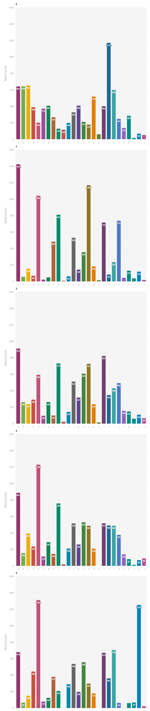

# What's the best word to start Wordle with? 🤔🧩

Annoyed by how many colorless letters greeted me at the start of Wordle every day, I decided to find out what's the best way to start this game (without cheating - I didn't use the actual Wordle words).

## Steps 📝
1. Get all the words. 
2. Filter to only 5-letter words.
3. Find the most used letters for each position.
4. If the word with the top-used letters is not a valid word, use Levenshtein Distance to find the nearest possible word (without double letter use).

## Conclusion
The best word to start with is...  
🥁🥁🥁🥁🥁🥁🥁🥁

<!-- <button style='background-color:#42ed70;color:white'>S</button><button style='background-color:#42ed70;color:white'>A</button><button style='background-color:#42ed70;color:white'>U</button><button style='background-color:#42ed70;color:white'>T</button><button style='background-color:#42ed70;color:white'>E</button> -->

<!--  -->


The complete code is given below - admittedly, it's not the most advanced statistical analysis but for a 5-letter word game that I do while brushing my teeth, I am satisfied with the results.

<!--  -->

---


# Code 

```python
# import libraries

from nltk.corpus import words
import nltk
from collections import defaultdict
from tqdm import tqdm
```

# Download Words with NLTK


```python
nltk.download('words') # download words

word_list = words.words() # get list of words
```

    [nltk_data] Downloading package words to
    [nltk_data]     /Users/rehanahmed/nltk_data...
    [nltk_data]   Package words is already up-to-date!


```python
print(len(word_list)) # Total Words
```

    236736


# Get Words with 5 Letters and First Letter Lower


```python
word_list = list(filter(lambda a:len(a)==5 and a[0].lower()==a[0],word_list))
```


```python
# Get counts of each letter at each position

letter_dict = defaultdict(int)

for word in tqdm(word_list):
    
    for l in [l+str(i) for i,l in enumerate(word)]:
        letter_dict[l]+=1
    
```

    100%|███████████████████████████████████| 8689/8689 [00:00<00:00, 462873.02it/s]


```python
# Sorted best counts of each letter at each position

combine_dict = {}
ans = []
top_ans = []

for i in range(0,5):
    combine_dict[i] = {}
    for key,value in letter_dict.items():
        if str(i) in key:
            combine_dict[i][key]=value
    top_ans.extend(sorted(combine_dict[i].items(), key=lambda item: -item[1])[0:1])
    ans.extend(sorted(combine_dict[i].items(), key=lambda item: -item[1]))
```

# Best Word


```python
best_word = ''.join([i[0][0] for i in top_ans])
print(best_word)
```

    saaee


However, this word does not exist, so we need to find the nearest best word.

## Using Levenshtein Distance to find the nearest Best Words


```python
# Source : https://stackoverflow.com/questions/2460177/edit-distance-in-python

def levenshteinDistance(s1):
    s2 = 'saaee'
    
    if len(s1) > len(s2):
        s1, s2 = s2, s1

    distances = range(len(s1) + 1)
    for i2, c2 in enumerate(s2):
        distances_ = [i2+1]
        for i1, c1 in enumerate(s1):
            if c1 == c2:
                distances_.append(distances[i1])
            else:
                distances_.append(1 + min((distances[i1], distances[i1 + 1], distances_[-1])))
        distances = distances_
    return distances[-1]
```


```python
scores = list(map(levenshteinDistance,word_list))
print(min(scores))

min_score = min(scores)
```

    2


## Best Score == 2


```python
results = []
for c,i in enumerate(scores):
    if i ==min_score:
        results.append(word_list[c])
```


```python
print(results)
```

    ['gagee', 'galee', 'gazee', 'payee', 'razee', 'saber', 'sable', 'sadhe', 'safen', 'sahme', 'saker', 'salep', 'salle', 'salse', 'salve', 'samel', 'samen', 'sapek', 'saple', 'sauce', 'saute', 'sauve', 'saved', 'saver', 'sawed', 'sawer', 'sayer', 'sazen', 'scale', 'scape', 'scare', 'scase', 'scree', 'seave', 'shade', 'shake', 'shale', 'shame', 'shape', 'share', 'shave', 'shree', 'skate', 'slade', 'slake', 'slane', 'slape', 'slare', 'slate', 'slave', 'smaze', 'snake', 'snape', 'snare', 'soree', 'space', 'spade', 'spaer', 'spale', 'spane', 'spare', 'spate', 'spave', 'spree', 'stade', 'stage', 'stake', 'stale', 'stane', 'stare', 'state', 'stave', 'stree', 'suade', 'suave', 'swage', 'swale', 'swape', 'sware', 'sycee', 'scale', 'shade', 'shake', 'shame', 'snake', 'space', 'spade', 'stage']


Still too many words

How about we add all the letter counts and get the word with the highest count?


```python
tot_scores = []
for i in results:
    sc = 0

    for c,l in enumerate(i):
        find = l+str(c)
#         print(find)
        for t in ans:
            if find == t[0]:
#                 print(t[1])
                sc = sc+t[1]
    tot_scores.append((i,sc))
```


```python
sorted(tot_scores,key=lambda a:a[1])[-1]
```


    ('soree', 5704)


But as anyone who has played this game can tell you, starting with two of the same letters (**e**) is probably not a good idea. So how about we use the next best word without double words?


```python
sorted(tot_scores,key=lambda a:a[1])[::-1][0:10]
```


    [('soree', 5704),
     ('shree', 5018),
     ('salle', 4934),
     ('salse', 4908),
     ('saute', 4886),
     ('galee', 4884),
     ('sauce', 4791),
     ('stree', 4770),
     ('saber', 4757),
     ('spree', 4717)]


```python
sorted(tot_scores,key=lambda a:a[1])[::-1][4]
```


    ('saute', 4886)


Also, here is a chart with the highest letter counts for each position.

<a href = "https://public.flourish.studio/visualisation/8535113/"></a>
